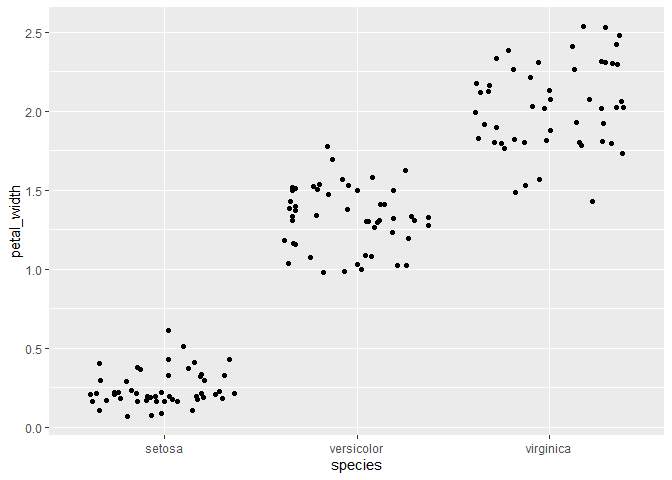
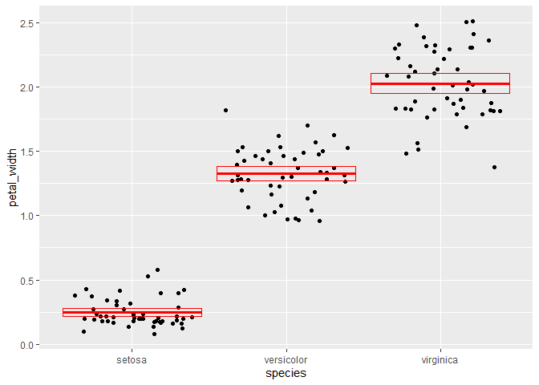
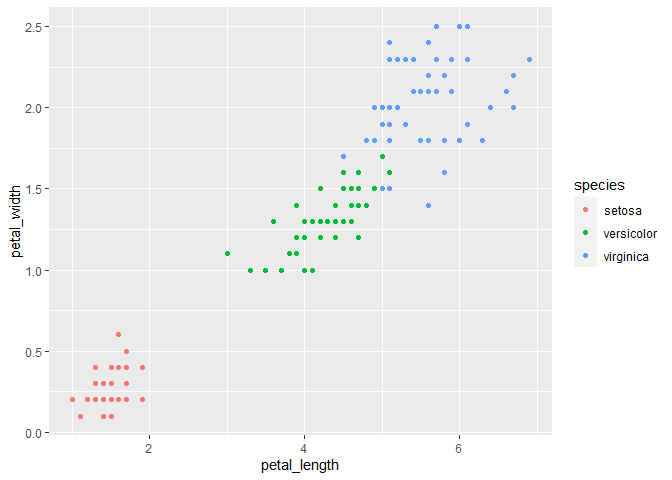

LAb 5
================
keenan schissel
2/23/2021

Packages

``` r
library(tidyverse)
```

    ## -- Attaching packages --------------------------------------- tidyverse 1.3.0 --

    ## v ggplot2 3.3.3     v purrr   0.3.4
    ## v tibble  3.0.4     v dplyr   1.0.2
    ## v tidyr   1.1.2     v stringr 1.4.0
    ## v readr   1.4.0     v forcats 0.5.0

    ## -- Conflicts ------------------------------------------ tidyverse_conflicts() --
    ## x dplyr::filter() masks stats::filter()
    ## x dplyr::lag()    masks stats::lag()

Rename each variable so that it is all lower-case and uses an underscore
\_ instead of a period . in the name (the recommended coding style in
the tidyverse style guide). Print the resulting table.

``` r
Q1<-rename(iris,sepal_length=Sepal.Length,sepal_width=Sepal.Width,petal_length=Petal.Length,petal_width=Petal.Width,species=Species)
Q1
```

    ##     sepal_length sepal_width petal_length petal_width    species
    ## 1            5.1         3.5          1.4         0.2     setosa
    ## 2            4.9         3.0          1.4         0.2     setosa
    ## 3            4.7         3.2          1.3         0.2     setosa
    ## 4            4.6         3.1          1.5         0.2     setosa
    ## 5            5.0         3.6          1.4         0.2     setosa
    ## 6            5.4         3.9          1.7         0.4     setosa
    ## 7            4.6         3.4          1.4         0.3     setosa
    ## 8            5.0         3.4          1.5         0.2     setosa
    ## 9            4.4         2.9          1.4         0.2     setosa
    ## 10           4.9         3.1          1.5         0.1     setosa
    ## 11           5.4         3.7          1.5         0.2     setosa
    ## 12           4.8         3.4          1.6         0.2     setosa
    ## 13           4.8         3.0          1.4         0.1     setosa
    ## 14           4.3         3.0          1.1         0.1     setosa
    ## 15           5.8         4.0          1.2         0.2     setosa
    ## 16           5.7         4.4          1.5         0.4     setosa
    ## 17           5.4         3.9          1.3         0.4     setosa
    ## 18           5.1         3.5          1.4         0.3     setosa
    ## 19           5.7         3.8          1.7         0.3     setosa
    ## 20           5.1         3.8          1.5         0.3     setosa
    ## 21           5.4         3.4          1.7         0.2     setosa
    ## 22           5.1         3.7          1.5         0.4     setosa
    ## 23           4.6         3.6          1.0         0.2     setosa
    ## 24           5.1         3.3          1.7         0.5     setosa
    ## 25           4.8         3.4          1.9         0.2     setosa
    ## 26           5.0         3.0          1.6         0.2     setosa
    ## 27           5.0         3.4          1.6         0.4     setosa
    ## 28           5.2         3.5          1.5         0.2     setosa
    ## 29           5.2         3.4          1.4         0.2     setosa
    ## 30           4.7         3.2          1.6         0.2     setosa
    ## 31           4.8         3.1          1.6         0.2     setosa
    ## 32           5.4         3.4          1.5         0.4     setosa
    ## 33           5.2         4.1          1.5         0.1     setosa
    ## 34           5.5         4.2          1.4         0.2     setosa
    ## 35           4.9         3.1          1.5         0.2     setosa
    ## 36           5.0         3.2          1.2         0.2     setosa
    ## 37           5.5         3.5          1.3         0.2     setosa
    ## 38           4.9         3.6          1.4         0.1     setosa
    ## 39           4.4         3.0          1.3         0.2     setosa
    ## 40           5.1         3.4          1.5         0.2     setosa
    ## 41           5.0         3.5          1.3         0.3     setosa
    ## 42           4.5         2.3          1.3         0.3     setosa
    ## 43           4.4         3.2          1.3         0.2     setosa
    ## 44           5.0         3.5          1.6         0.6     setosa
    ## 45           5.1         3.8          1.9         0.4     setosa
    ## 46           4.8         3.0          1.4         0.3     setosa
    ## 47           5.1         3.8          1.6         0.2     setosa
    ## 48           4.6         3.2          1.4         0.2     setosa
    ## 49           5.3         3.7          1.5         0.2     setosa
    ## 50           5.0         3.3          1.4         0.2     setosa
    ## 51           7.0         3.2          4.7         1.4 versicolor
    ## 52           6.4         3.2          4.5         1.5 versicolor
    ## 53           6.9         3.1          4.9         1.5 versicolor
    ## 54           5.5         2.3          4.0         1.3 versicolor
    ## 55           6.5         2.8          4.6         1.5 versicolor
    ## 56           5.7         2.8          4.5         1.3 versicolor
    ## 57           6.3         3.3          4.7         1.6 versicolor
    ## 58           4.9         2.4          3.3         1.0 versicolor
    ## 59           6.6         2.9          4.6         1.3 versicolor
    ## 60           5.2         2.7          3.9         1.4 versicolor
    ## 61           5.0         2.0          3.5         1.0 versicolor
    ## 62           5.9         3.0          4.2         1.5 versicolor
    ## 63           6.0         2.2          4.0         1.0 versicolor
    ## 64           6.1         2.9          4.7         1.4 versicolor
    ## 65           5.6         2.9          3.6         1.3 versicolor
    ## 66           6.7         3.1          4.4         1.4 versicolor
    ## 67           5.6         3.0          4.5         1.5 versicolor
    ## 68           5.8         2.7          4.1         1.0 versicolor
    ## 69           6.2         2.2          4.5         1.5 versicolor
    ## 70           5.6         2.5          3.9         1.1 versicolor
    ## 71           5.9         3.2          4.8         1.8 versicolor
    ## 72           6.1         2.8          4.0         1.3 versicolor
    ## 73           6.3         2.5          4.9         1.5 versicolor
    ## 74           6.1         2.8          4.7         1.2 versicolor
    ## 75           6.4         2.9          4.3         1.3 versicolor
    ## 76           6.6         3.0          4.4         1.4 versicolor
    ## 77           6.8         2.8          4.8         1.4 versicolor
    ## 78           6.7         3.0          5.0         1.7 versicolor
    ## 79           6.0         2.9          4.5         1.5 versicolor
    ## 80           5.7         2.6          3.5         1.0 versicolor
    ## 81           5.5         2.4          3.8         1.1 versicolor
    ## 82           5.5         2.4          3.7         1.0 versicolor
    ## 83           5.8         2.7          3.9         1.2 versicolor
    ## 84           6.0         2.7          5.1         1.6 versicolor
    ## 85           5.4         3.0          4.5         1.5 versicolor
    ## 86           6.0         3.4          4.5         1.6 versicolor
    ## 87           6.7         3.1          4.7         1.5 versicolor
    ## 88           6.3         2.3          4.4         1.3 versicolor
    ## 89           5.6         3.0          4.1         1.3 versicolor
    ## 90           5.5         2.5          4.0         1.3 versicolor
    ## 91           5.5         2.6          4.4         1.2 versicolor
    ## 92           6.1         3.0          4.6         1.4 versicolor
    ## 93           5.8         2.6          4.0         1.2 versicolor
    ## 94           5.0         2.3          3.3         1.0 versicolor
    ## 95           5.6         2.7          4.2         1.3 versicolor
    ## 96           5.7         3.0          4.2         1.2 versicolor
    ## 97           5.7         2.9          4.2         1.3 versicolor
    ## 98           6.2         2.9          4.3         1.3 versicolor
    ## 99           5.1         2.5          3.0         1.1 versicolor
    ## 100          5.7         2.8          4.1         1.3 versicolor
    ## 101          6.3         3.3          6.0         2.5  virginica
    ## 102          5.8         2.7          5.1         1.9  virginica
    ## 103          7.1         3.0          5.9         2.1  virginica
    ## 104          6.3         2.9          5.6         1.8  virginica
    ## 105          6.5         3.0          5.8         2.2  virginica
    ## 106          7.6         3.0          6.6         2.1  virginica
    ## 107          4.9         2.5          4.5         1.7  virginica
    ## 108          7.3         2.9          6.3         1.8  virginica
    ## 109          6.7         2.5          5.8         1.8  virginica
    ## 110          7.2         3.6          6.1         2.5  virginica
    ## 111          6.5         3.2          5.1         2.0  virginica
    ## 112          6.4         2.7          5.3         1.9  virginica
    ## 113          6.8         3.0          5.5         2.1  virginica
    ## 114          5.7         2.5          5.0         2.0  virginica
    ## 115          5.8         2.8          5.1         2.4  virginica
    ## 116          6.4         3.2          5.3         2.3  virginica
    ## 117          6.5         3.0          5.5         1.8  virginica
    ## 118          7.7         3.8          6.7         2.2  virginica
    ## 119          7.7         2.6          6.9         2.3  virginica
    ## 120          6.0         2.2          5.0         1.5  virginica
    ## 121          6.9         3.2          5.7         2.3  virginica
    ## 122          5.6         2.8          4.9         2.0  virginica
    ## 123          7.7         2.8          6.7         2.0  virginica
    ## 124          6.3         2.7          4.9         1.8  virginica
    ## 125          6.7         3.3          5.7         2.1  virginica
    ## 126          7.2         3.2          6.0         1.8  virginica
    ## 127          6.2         2.8          4.8         1.8  virginica
    ## 128          6.1         3.0          4.9         1.8  virginica
    ## 129          6.4         2.8          5.6         2.1  virginica
    ## 130          7.2         3.0          5.8         1.6  virginica
    ## 131          7.4         2.8          6.1         1.9  virginica
    ## 132          7.9         3.8          6.4         2.0  virginica
    ## 133          6.4         2.8          5.6         2.2  virginica
    ## 134          6.3         2.8          5.1         1.5  virginica
    ## 135          6.1         2.6          5.6         1.4  virginica
    ## 136          7.7         3.0          6.1         2.3  virginica
    ## 137          6.3         3.4          5.6         2.4  virginica
    ## 138          6.4         3.1          5.5         1.8  virginica
    ## 139          6.0         3.0          4.8         1.8  virginica
    ## 140          6.9         3.1          5.4         2.1  virginica
    ## 141          6.7         3.1          5.6         2.4  virginica
    ## 142          6.9         3.1          5.1         2.3  virginica
    ## 143          5.8         2.7          5.1         1.9  virginica
    ## 144          6.8         3.2          5.9         2.3  virginica
    ## 145          6.7         3.3          5.7         2.5  virginica
    ## 146          6.7         3.0          5.2         2.3  virginica
    ## 147          6.3         2.5          5.0         1.9  virginica
    ## 148          6.5         3.0          5.2         2.0  virginica
    ## 149          6.2         3.4          5.4         2.3  virginica
    ## 150          5.9         3.0          5.1         1.8  virginica

Convert the four numerical variables from cm to mm by multiplying by 10.
Print the resulting table.

``` r
Q2<-select(Q1, sepal_length, sepal_width, petal_length, petal_width)
Q2
```

    ##     sepal_length sepal_width petal_length petal_width
    ## 1            5.1         3.5          1.4         0.2
    ## 2            4.9         3.0          1.4         0.2
    ## 3            4.7         3.2          1.3         0.2
    ## 4            4.6         3.1          1.5         0.2
    ## 5            5.0         3.6          1.4         0.2
    ## 6            5.4         3.9          1.7         0.4
    ## 7            4.6         3.4          1.4         0.3
    ## 8            5.0         3.4          1.5         0.2
    ## 9            4.4         2.9          1.4         0.2
    ## 10           4.9         3.1          1.5         0.1
    ## 11           5.4         3.7          1.5         0.2
    ## 12           4.8         3.4          1.6         0.2
    ## 13           4.8         3.0          1.4         0.1
    ## 14           4.3         3.0          1.1         0.1
    ## 15           5.8         4.0          1.2         0.2
    ## 16           5.7         4.4          1.5         0.4
    ## 17           5.4         3.9          1.3         0.4
    ## 18           5.1         3.5          1.4         0.3
    ## 19           5.7         3.8          1.7         0.3
    ## 20           5.1         3.8          1.5         0.3
    ## 21           5.4         3.4          1.7         0.2
    ## 22           5.1         3.7          1.5         0.4
    ## 23           4.6         3.6          1.0         0.2
    ## 24           5.1         3.3          1.7         0.5
    ## 25           4.8         3.4          1.9         0.2
    ## 26           5.0         3.0          1.6         0.2
    ## 27           5.0         3.4          1.6         0.4
    ## 28           5.2         3.5          1.5         0.2
    ## 29           5.2         3.4          1.4         0.2
    ## 30           4.7         3.2          1.6         0.2
    ## 31           4.8         3.1          1.6         0.2
    ## 32           5.4         3.4          1.5         0.4
    ## 33           5.2         4.1          1.5         0.1
    ## 34           5.5         4.2          1.4         0.2
    ## 35           4.9         3.1          1.5         0.2
    ## 36           5.0         3.2          1.2         0.2
    ## 37           5.5         3.5          1.3         0.2
    ## 38           4.9         3.6          1.4         0.1
    ## 39           4.4         3.0          1.3         0.2
    ## 40           5.1         3.4          1.5         0.2
    ## 41           5.0         3.5          1.3         0.3
    ## 42           4.5         2.3          1.3         0.3
    ## 43           4.4         3.2          1.3         0.2
    ## 44           5.0         3.5          1.6         0.6
    ## 45           5.1         3.8          1.9         0.4
    ## 46           4.8         3.0          1.4         0.3
    ## 47           5.1         3.8          1.6         0.2
    ## 48           4.6         3.2          1.4         0.2
    ## 49           5.3         3.7          1.5         0.2
    ## 50           5.0         3.3          1.4         0.2
    ## 51           7.0         3.2          4.7         1.4
    ## 52           6.4         3.2          4.5         1.5
    ## 53           6.9         3.1          4.9         1.5
    ## 54           5.5         2.3          4.0         1.3
    ## 55           6.5         2.8          4.6         1.5
    ## 56           5.7         2.8          4.5         1.3
    ## 57           6.3         3.3          4.7         1.6
    ## 58           4.9         2.4          3.3         1.0
    ## 59           6.6         2.9          4.6         1.3
    ## 60           5.2         2.7          3.9         1.4
    ## 61           5.0         2.0          3.5         1.0
    ## 62           5.9         3.0          4.2         1.5
    ## 63           6.0         2.2          4.0         1.0
    ## 64           6.1         2.9          4.7         1.4
    ## 65           5.6         2.9          3.6         1.3
    ## 66           6.7         3.1          4.4         1.4
    ## 67           5.6         3.0          4.5         1.5
    ## 68           5.8         2.7          4.1         1.0
    ## 69           6.2         2.2          4.5         1.5
    ## 70           5.6         2.5          3.9         1.1
    ## 71           5.9         3.2          4.8         1.8
    ## 72           6.1         2.8          4.0         1.3
    ## 73           6.3         2.5          4.9         1.5
    ## 74           6.1         2.8          4.7         1.2
    ## 75           6.4         2.9          4.3         1.3
    ## 76           6.6         3.0          4.4         1.4
    ## 77           6.8         2.8          4.8         1.4
    ## 78           6.7         3.0          5.0         1.7
    ## 79           6.0         2.9          4.5         1.5
    ## 80           5.7         2.6          3.5         1.0
    ## 81           5.5         2.4          3.8         1.1
    ## 82           5.5         2.4          3.7         1.0
    ## 83           5.8         2.7          3.9         1.2
    ## 84           6.0         2.7          5.1         1.6
    ## 85           5.4         3.0          4.5         1.5
    ## 86           6.0         3.4          4.5         1.6
    ## 87           6.7         3.1          4.7         1.5
    ## 88           6.3         2.3          4.4         1.3
    ## 89           5.6         3.0          4.1         1.3
    ## 90           5.5         2.5          4.0         1.3
    ## 91           5.5         2.6          4.4         1.2
    ## 92           6.1         3.0          4.6         1.4
    ## 93           5.8         2.6          4.0         1.2
    ## 94           5.0         2.3          3.3         1.0
    ## 95           5.6         2.7          4.2         1.3
    ## 96           5.7         3.0          4.2         1.2
    ## 97           5.7         2.9          4.2         1.3
    ## 98           6.2         2.9          4.3         1.3
    ## 99           5.1         2.5          3.0         1.1
    ## 100          5.7         2.8          4.1         1.3
    ## 101          6.3         3.3          6.0         2.5
    ## 102          5.8         2.7          5.1         1.9
    ## 103          7.1         3.0          5.9         2.1
    ## 104          6.3         2.9          5.6         1.8
    ## 105          6.5         3.0          5.8         2.2
    ## 106          7.6         3.0          6.6         2.1
    ## 107          4.9         2.5          4.5         1.7
    ## 108          7.3         2.9          6.3         1.8
    ## 109          6.7         2.5          5.8         1.8
    ## 110          7.2         3.6          6.1         2.5
    ## 111          6.5         3.2          5.1         2.0
    ## 112          6.4         2.7          5.3         1.9
    ## 113          6.8         3.0          5.5         2.1
    ## 114          5.7         2.5          5.0         2.0
    ## 115          5.8         2.8          5.1         2.4
    ## 116          6.4         3.2          5.3         2.3
    ## 117          6.5         3.0          5.5         1.8
    ## 118          7.7         3.8          6.7         2.2
    ## 119          7.7         2.6          6.9         2.3
    ## 120          6.0         2.2          5.0         1.5
    ## 121          6.9         3.2          5.7         2.3
    ## 122          5.6         2.8          4.9         2.0
    ## 123          7.7         2.8          6.7         2.0
    ## 124          6.3         2.7          4.9         1.8
    ## 125          6.7         3.3          5.7         2.1
    ## 126          7.2         3.2          6.0         1.8
    ## 127          6.2         2.8          4.8         1.8
    ## 128          6.1         3.0          4.9         1.8
    ## 129          6.4         2.8          5.6         2.1
    ## 130          7.2         3.0          5.8         1.6
    ## 131          7.4         2.8          6.1         1.9
    ## 132          7.9         3.8          6.4         2.0
    ## 133          6.4         2.8          5.6         2.2
    ## 134          6.3         2.8          5.1         1.5
    ## 135          6.1         2.6          5.6         1.4
    ## 136          7.7         3.0          6.1         2.3
    ## 137          6.3         3.4          5.6         2.4
    ## 138          6.4         3.1          5.5         1.8
    ## 139          6.0         3.0          4.8         1.8
    ## 140          6.9         3.1          5.4         2.1
    ## 141          6.7         3.1          5.6         2.4
    ## 142          6.9         3.1          5.1         2.3
    ## 143          5.8         2.7          5.1         1.9
    ## 144          6.8         3.2          5.9         2.3
    ## 145          6.7         3.3          5.7         2.5
    ## 146          6.7         3.0          5.2         2.3
    ## 147          6.3         2.5          5.0         1.9
    ## 148          6.5         3.0          5.2         2.0
    ## 149          6.2         3.4          5.4         2.3
    ## 150          5.9         3.0          5.1         1.8

``` r
mutate(Q1, Q2 = Q2 * 10)
```

    ##     sepal_length sepal_width petal_length petal_width    species
    ## 1            5.1         3.5          1.4         0.2     setosa
    ## 2            4.9         3.0          1.4         0.2     setosa
    ## 3            4.7         3.2          1.3         0.2     setosa
    ## 4            4.6         3.1          1.5         0.2     setosa
    ## 5            5.0         3.6          1.4         0.2     setosa
    ## 6            5.4         3.9          1.7         0.4     setosa
    ## 7            4.6         3.4          1.4         0.3     setosa
    ## 8            5.0         3.4          1.5         0.2     setosa
    ## 9            4.4         2.9          1.4         0.2     setosa
    ## 10           4.9         3.1          1.5         0.1     setosa
    ## 11           5.4         3.7          1.5         0.2     setosa
    ## 12           4.8         3.4          1.6         0.2     setosa
    ## 13           4.8         3.0          1.4         0.1     setosa
    ## 14           4.3         3.0          1.1         0.1     setosa
    ## 15           5.8         4.0          1.2         0.2     setosa
    ## 16           5.7         4.4          1.5         0.4     setosa
    ## 17           5.4         3.9          1.3         0.4     setosa
    ## 18           5.1         3.5          1.4         0.3     setosa
    ## 19           5.7         3.8          1.7         0.3     setosa
    ## 20           5.1         3.8          1.5         0.3     setosa
    ## 21           5.4         3.4          1.7         0.2     setosa
    ## 22           5.1         3.7          1.5         0.4     setosa
    ## 23           4.6         3.6          1.0         0.2     setosa
    ## 24           5.1         3.3          1.7         0.5     setosa
    ## 25           4.8         3.4          1.9         0.2     setosa
    ## 26           5.0         3.0          1.6         0.2     setosa
    ## 27           5.0         3.4          1.6         0.4     setosa
    ## 28           5.2         3.5          1.5         0.2     setosa
    ## 29           5.2         3.4          1.4         0.2     setosa
    ## 30           4.7         3.2          1.6         0.2     setosa
    ## 31           4.8         3.1          1.6         0.2     setosa
    ## 32           5.4         3.4          1.5         0.4     setosa
    ## 33           5.2         4.1          1.5         0.1     setosa
    ## 34           5.5         4.2          1.4         0.2     setosa
    ## 35           4.9         3.1          1.5         0.2     setosa
    ## 36           5.0         3.2          1.2         0.2     setosa
    ## 37           5.5         3.5          1.3         0.2     setosa
    ## 38           4.9         3.6          1.4         0.1     setosa
    ## 39           4.4         3.0          1.3         0.2     setosa
    ## 40           5.1         3.4          1.5         0.2     setosa
    ## 41           5.0         3.5          1.3         0.3     setosa
    ## 42           4.5         2.3          1.3         0.3     setosa
    ## 43           4.4         3.2          1.3         0.2     setosa
    ## 44           5.0         3.5          1.6         0.6     setosa
    ## 45           5.1         3.8          1.9         0.4     setosa
    ## 46           4.8         3.0          1.4         0.3     setosa
    ## 47           5.1         3.8          1.6         0.2     setosa
    ## 48           4.6         3.2          1.4         0.2     setosa
    ## 49           5.3         3.7          1.5         0.2     setosa
    ## 50           5.0         3.3          1.4         0.2     setosa
    ## 51           7.0         3.2          4.7         1.4 versicolor
    ## 52           6.4         3.2          4.5         1.5 versicolor
    ## 53           6.9         3.1          4.9         1.5 versicolor
    ## 54           5.5         2.3          4.0         1.3 versicolor
    ## 55           6.5         2.8          4.6         1.5 versicolor
    ## 56           5.7         2.8          4.5         1.3 versicolor
    ## 57           6.3         3.3          4.7         1.6 versicolor
    ## 58           4.9         2.4          3.3         1.0 versicolor
    ## 59           6.6         2.9          4.6         1.3 versicolor
    ## 60           5.2         2.7          3.9         1.4 versicolor
    ## 61           5.0         2.0          3.5         1.0 versicolor
    ## 62           5.9         3.0          4.2         1.5 versicolor
    ## 63           6.0         2.2          4.0         1.0 versicolor
    ## 64           6.1         2.9          4.7         1.4 versicolor
    ## 65           5.6         2.9          3.6         1.3 versicolor
    ## 66           6.7         3.1          4.4         1.4 versicolor
    ## 67           5.6         3.0          4.5         1.5 versicolor
    ## 68           5.8         2.7          4.1         1.0 versicolor
    ## 69           6.2         2.2          4.5         1.5 versicolor
    ## 70           5.6         2.5          3.9         1.1 versicolor
    ## 71           5.9         3.2          4.8         1.8 versicolor
    ## 72           6.1         2.8          4.0         1.3 versicolor
    ## 73           6.3         2.5          4.9         1.5 versicolor
    ## 74           6.1         2.8          4.7         1.2 versicolor
    ## 75           6.4         2.9          4.3         1.3 versicolor
    ## 76           6.6         3.0          4.4         1.4 versicolor
    ## 77           6.8         2.8          4.8         1.4 versicolor
    ## 78           6.7         3.0          5.0         1.7 versicolor
    ## 79           6.0         2.9          4.5         1.5 versicolor
    ## 80           5.7         2.6          3.5         1.0 versicolor
    ## 81           5.5         2.4          3.8         1.1 versicolor
    ## 82           5.5         2.4          3.7         1.0 versicolor
    ## 83           5.8         2.7          3.9         1.2 versicolor
    ## 84           6.0         2.7          5.1         1.6 versicolor
    ## 85           5.4         3.0          4.5         1.5 versicolor
    ## 86           6.0         3.4          4.5         1.6 versicolor
    ## 87           6.7         3.1          4.7         1.5 versicolor
    ## 88           6.3         2.3          4.4         1.3 versicolor
    ## 89           5.6         3.0          4.1         1.3 versicolor
    ## 90           5.5         2.5          4.0         1.3 versicolor
    ## 91           5.5         2.6          4.4         1.2 versicolor
    ## 92           6.1         3.0          4.6         1.4 versicolor
    ## 93           5.8         2.6          4.0         1.2 versicolor
    ## 94           5.0         2.3          3.3         1.0 versicolor
    ## 95           5.6         2.7          4.2         1.3 versicolor
    ## 96           5.7         3.0          4.2         1.2 versicolor
    ## 97           5.7         2.9          4.2         1.3 versicolor
    ## 98           6.2         2.9          4.3         1.3 versicolor
    ## 99           5.1         2.5          3.0         1.1 versicolor
    ## 100          5.7         2.8          4.1         1.3 versicolor
    ## 101          6.3         3.3          6.0         2.5  virginica
    ## 102          5.8         2.7          5.1         1.9  virginica
    ## 103          7.1         3.0          5.9         2.1  virginica
    ## 104          6.3         2.9          5.6         1.8  virginica
    ## 105          6.5         3.0          5.8         2.2  virginica
    ## 106          7.6         3.0          6.6         2.1  virginica
    ## 107          4.9         2.5          4.5         1.7  virginica
    ## 108          7.3         2.9          6.3         1.8  virginica
    ## 109          6.7         2.5          5.8         1.8  virginica
    ## 110          7.2         3.6          6.1         2.5  virginica
    ## 111          6.5         3.2          5.1         2.0  virginica
    ## 112          6.4         2.7          5.3         1.9  virginica
    ## 113          6.8         3.0          5.5         2.1  virginica
    ## 114          5.7         2.5          5.0         2.0  virginica
    ## 115          5.8         2.8          5.1         2.4  virginica
    ## 116          6.4         3.2          5.3         2.3  virginica
    ## 117          6.5         3.0          5.5         1.8  virginica
    ## 118          7.7         3.8          6.7         2.2  virginica
    ## 119          7.7         2.6          6.9         2.3  virginica
    ## 120          6.0         2.2          5.0         1.5  virginica
    ## 121          6.9         3.2          5.7         2.3  virginica
    ## 122          5.6         2.8          4.9         2.0  virginica
    ## 123          7.7         2.8          6.7         2.0  virginica
    ## 124          6.3         2.7          4.9         1.8  virginica
    ## 125          6.7         3.3          5.7         2.1  virginica
    ## 126          7.2         3.2          6.0         1.8  virginica
    ## 127          6.2         2.8          4.8         1.8  virginica
    ## 128          6.1         3.0          4.9         1.8  virginica
    ## 129          6.4         2.8          5.6         2.1  virginica
    ## 130          7.2         3.0          5.8         1.6  virginica
    ## 131          7.4         2.8          6.1         1.9  virginica
    ## 132          7.9         3.8          6.4         2.0  virginica
    ## 133          6.4         2.8          5.6         2.2  virginica
    ## 134          6.3         2.8          5.1         1.5  virginica
    ## 135          6.1         2.6          5.6         1.4  virginica
    ## 136          7.7         3.0          6.1         2.3  virginica
    ## 137          6.3         3.4          5.6         2.4  virginica
    ## 138          6.4         3.1          5.5         1.8  virginica
    ## 139          6.0         3.0          4.8         1.8  virginica
    ## 140          6.9         3.1          5.4         2.1  virginica
    ## 141          6.7         3.1          5.6         2.4  virginica
    ## 142          6.9         3.1          5.1         2.3  virginica
    ## 143          5.8         2.7          5.1         1.9  virginica
    ## 144          6.8         3.2          5.9         2.3  virginica
    ## 145          6.7         3.3          5.7         2.5  virginica
    ## 146          6.7         3.0          5.2         2.3  virginica
    ## 147          6.3         2.5          5.0         1.9  virginica
    ## 148          6.5         3.0          5.2         2.0  virginica
    ## 149          6.2         3.4          5.4         2.3  virginica
    ## 150          5.9         3.0          5.1         1.8  virginica
    ##     Q2.sepal_length Q2.sepal_width Q2.petal_length Q2.petal_width
    ## 1                51             35              14              2
    ## 2                49             30              14              2
    ## 3                47             32              13              2
    ## 4                46             31              15              2
    ## 5                50             36              14              2
    ## 6                54             39              17              4
    ## 7                46             34              14              3
    ## 8                50             34              15              2
    ## 9                44             29              14              2
    ## 10               49             31              15              1
    ## 11               54             37              15              2
    ## 12               48             34              16              2
    ## 13               48             30              14              1
    ## 14               43             30              11              1
    ## 15               58             40              12              2
    ## 16               57             44              15              4
    ## 17               54             39              13              4
    ## 18               51             35              14              3
    ## 19               57             38              17              3
    ## 20               51             38              15              3
    ## 21               54             34              17              2
    ## 22               51             37              15              4
    ## 23               46             36              10              2
    ## 24               51             33              17              5
    ## 25               48             34              19              2
    ## 26               50             30              16              2
    ## 27               50             34              16              4
    ## 28               52             35              15              2
    ## 29               52             34              14              2
    ## 30               47             32              16              2
    ## 31               48             31              16              2
    ## 32               54             34              15              4
    ## 33               52             41              15              1
    ## 34               55             42              14              2
    ## 35               49             31              15              2
    ## 36               50             32              12              2
    ## 37               55             35              13              2
    ## 38               49             36              14              1
    ## 39               44             30              13              2
    ## 40               51             34              15              2
    ## 41               50             35              13              3
    ## 42               45             23              13              3
    ## 43               44             32              13              2
    ## 44               50             35              16              6
    ## 45               51             38              19              4
    ## 46               48             30              14              3
    ## 47               51             38              16              2
    ## 48               46             32              14              2
    ## 49               53             37              15              2
    ## 50               50             33              14              2
    ## 51               70             32              47             14
    ## 52               64             32              45             15
    ## 53               69             31              49             15
    ## 54               55             23              40             13
    ## 55               65             28              46             15
    ## 56               57             28              45             13
    ## 57               63             33              47             16
    ## 58               49             24              33             10
    ## 59               66             29              46             13
    ## 60               52             27              39             14
    ## 61               50             20              35             10
    ## 62               59             30              42             15
    ## 63               60             22              40             10
    ## 64               61             29              47             14
    ## 65               56             29              36             13
    ## 66               67             31              44             14
    ## 67               56             30              45             15
    ## 68               58             27              41             10
    ## 69               62             22              45             15
    ## 70               56             25              39             11
    ## 71               59             32              48             18
    ## 72               61             28              40             13
    ## 73               63             25              49             15
    ## 74               61             28              47             12
    ## 75               64             29              43             13
    ## 76               66             30              44             14
    ## 77               68             28              48             14
    ## 78               67             30              50             17
    ## 79               60             29              45             15
    ## 80               57             26              35             10
    ## 81               55             24              38             11
    ## 82               55             24              37             10
    ## 83               58             27              39             12
    ## 84               60             27              51             16
    ## 85               54             30              45             15
    ## 86               60             34              45             16
    ## 87               67             31              47             15
    ## 88               63             23              44             13
    ## 89               56             30              41             13
    ## 90               55             25              40             13
    ## 91               55             26              44             12
    ## 92               61             30              46             14
    ## 93               58             26              40             12
    ## 94               50             23              33             10
    ## 95               56             27              42             13
    ## 96               57             30              42             12
    ## 97               57             29              42             13
    ## 98               62             29              43             13
    ## 99               51             25              30             11
    ## 100              57             28              41             13
    ## 101              63             33              60             25
    ## 102              58             27              51             19
    ## 103              71             30              59             21
    ## 104              63             29              56             18
    ## 105              65             30              58             22
    ## 106              76             30              66             21
    ## 107              49             25              45             17
    ## 108              73             29              63             18
    ## 109              67             25              58             18
    ## 110              72             36              61             25
    ## 111              65             32              51             20
    ## 112              64             27              53             19
    ## 113              68             30              55             21
    ## 114              57             25              50             20
    ## 115              58             28              51             24
    ## 116              64             32              53             23
    ## 117              65             30              55             18
    ## 118              77             38              67             22
    ## 119              77             26              69             23
    ## 120              60             22              50             15
    ## 121              69             32              57             23
    ## 122              56             28              49             20
    ## 123              77             28              67             20
    ## 124              63             27              49             18
    ## 125              67             33              57             21
    ## 126              72             32              60             18
    ## 127              62             28              48             18
    ## 128              61             30              49             18
    ## 129              64             28              56             21
    ## 130              72             30              58             16
    ## 131              74             28              61             19
    ## 132              79             38              64             20
    ## 133              64             28              56             22
    ## 134              63             28              51             15
    ## 135              61             26              56             14
    ## 136              77             30              61             23
    ## 137              63             34              56             24
    ## 138              64             31              55             18
    ## 139              60             30              48             18
    ## 140              69             31              54             21
    ## 141              67             31              56             24
    ## 142              69             31              51             23
    ## 143              58             27              51             19
    ## 144              68             32              59             23
    ## 145              67             33              57             25
    ## 146              67             30              52             23
    ## 147              63             25              50             19
    ## 148              65             30              52             20
    ## 149              62             34              54             23
    ## 150              59             30              51             18

Calculate sepal area and petal area (area is equal to length multiplied
by width). Print a table with only the variables sepal area, petal area,
and species.

``` r
Q3 <-mutate(Q1, sepal_area=sepal_length*sepal_width,petal_area=petal_length*petal_width)
Q3
```

    ##     sepal_length sepal_width petal_length petal_width    species sepal_area
    ## 1            5.1         3.5          1.4         0.2     setosa      17.85
    ## 2            4.9         3.0          1.4         0.2     setosa      14.70
    ## 3            4.7         3.2          1.3         0.2     setosa      15.04
    ## 4            4.6         3.1          1.5         0.2     setosa      14.26
    ## 5            5.0         3.6          1.4         0.2     setosa      18.00
    ## 6            5.4         3.9          1.7         0.4     setosa      21.06
    ## 7            4.6         3.4          1.4         0.3     setosa      15.64
    ## 8            5.0         3.4          1.5         0.2     setosa      17.00
    ## 9            4.4         2.9          1.4         0.2     setosa      12.76
    ## 10           4.9         3.1          1.5         0.1     setosa      15.19
    ## 11           5.4         3.7          1.5         0.2     setosa      19.98
    ## 12           4.8         3.4          1.6         0.2     setosa      16.32
    ## 13           4.8         3.0          1.4         0.1     setosa      14.40
    ## 14           4.3         3.0          1.1         0.1     setosa      12.90
    ## 15           5.8         4.0          1.2         0.2     setosa      23.20
    ## 16           5.7         4.4          1.5         0.4     setosa      25.08
    ## 17           5.4         3.9          1.3         0.4     setosa      21.06
    ## 18           5.1         3.5          1.4         0.3     setosa      17.85
    ## 19           5.7         3.8          1.7         0.3     setosa      21.66
    ## 20           5.1         3.8          1.5         0.3     setosa      19.38
    ## 21           5.4         3.4          1.7         0.2     setosa      18.36
    ## 22           5.1         3.7          1.5         0.4     setosa      18.87
    ## 23           4.6         3.6          1.0         0.2     setosa      16.56
    ## 24           5.1         3.3          1.7         0.5     setosa      16.83
    ## 25           4.8         3.4          1.9         0.2     setosa      16.32
    ## 26           5.0         3.0          1.6         0.2     setosa      15.00
    ## 27           5.0         3.4          1.6         0.4     setosa      17.00
    ## 28           5.2         3.5          1.5         0.2     setosa      18.20
    ## 29           5.2         3.4          1.4         0.2     setosa      17.68
    ## 30           4.7         3.2          1.6         0.2     setosa      15.04
    ## 31           4.8         3.1          1.6         0.2     setosa      14.88
    ## 32           5.4         3.4          1.5         0.4     setosa      18.36
    ## 33           5.2         4.1          1.5         0.1     setosa      21.32
    ## 34           5.5         4.2          1.4         0.2     setosa      23.10
    ## 35           4.9         3.1          1.5         0.2     setosa      15.19
    ## 36           5.0         3.2          1.2         0.2     setosa      16.00
    ## 37           5.5         3.5          1.3         0.2     setosa      19.25
    ## 38           4.9         3.6          1.4         0.1     setosa      17.64
    ## 39           4.4         3.0          1.3         0.2     setosa      13.20
    ## 40           5.1         3.4          1.5         0.2     setosa      17.34
    ## 41           5.0         3.5          1.3         0.3     setosa      17.50
    ## 42           4.5         2.3          1.3         0.3     setosa      10.35
    ## 43           4.4         3.2          1.3         0.2     setosa      14.08
    ## 44           5.0         3.5          1.6         0.6     setosa      17.50
    ## 45           5.1         3.8          1.9         0.4     setosa      19.38
    ## 46           4.8         3.0          1.4         0.3     setosa      14.40
    ## 47           5.1         3.8          1.6         0.2     setosa      19.38
    ## 48           4.6         3.2          1.4         0.2     setosa      14.72
    ## 49           5.3         3.7          1.5         0.2     setosa      19.61
    ## 50           5.0         3.3          1.4         0.2     setosa      16.50
    ## 51           7.0         3.2          4.7         1.4 versicolor      22.40
    ## 52           6.4         3.2          4.5         1.5 versicolor      20.48
    ## 53           6.9         3.1          4.9         1.5 versicolor      21.39
    ## 54           5.5         2.3          4.0         1.3 versicolor      12.65
    ## 55           6.5         2.8          4.6         1.5 versicolor      18.20
    ## 56           5.7         2.8          4.5         1.3 versicolor      15.96
    ## 57           6.3         3.3          4.7         1.6 versicolor      20.79
    ## 58           4.9         2.4          3.3         1.0 versicolor      11.76
    ## 59           6.6         2.9          4.6         1.3 versicolor      19.14
    ## 60           5.2         2.7          3.9         1.4 versicolor      14.04
    ## 61           5.0         2.0          3.5         1.0 versicolor      10.00
    ## 62           5.9         3.0          4.2         1.5 versicolor      17.70
    ## 63           6.0         2.2          4.0         1.0 versicolor      13.20
    ## 64           6.1         2.9          4.7         1.4 versicolor      17.69
    ## 65           5.6         2.9          3.6         1.3 versicolor      16.24
    ## 66           6.7         3.1          4.4         1.4 versicolor      20.77
    ## 67           5.6         3.0          4.5         1.5 versicolor      16.80
    ## 68           5.8         2.7          4.1         1.0 versicolor      15.66
    ## 69           6.2         2.2          4.5         1.5 versicolor      13.64
    ## 70           5.6         2.5          3.9         1.1 versicolor      14.00
    ## 71           5.9         3.2          4.8         1.8 versicolor      18.88
    ## 72           6.1         2.8          4.0         1.3 versicolor      17.08
    ## 73           6.3         2.5          4.9         1.5 versicolor      15.75
    ## 74           6.1         2.8          4.7         1.2 versicolor      17.08
    ## 75           6.4         2.9          4.3         1.3 versicolor      18.56
    ## 76           6.6         3.0          4.4         1.4 versicolor      19.80
    ## 77           6.8         2.8          4.8         1.4 versicolor      19.04
    ## 78           6.7         3.0          5.0         1.7 versicolor      20.10
    ## 79           6.0         2.9          4.5         1.5 versicolor      17.40
    ## 80           5.7         2.6          3.5         1.0 versicolor      14.82
    ## 81           5.5         2.4          3.8         1.1 versicolor      13.20
    ## 82           5.5         2.4          3.7         1.0 versicolor      13.20
    ## 83           5.8         2.7          3.9         1.2 versicolor      15.66
    ## 84           6.0         2.7          5.1         1.6 versicolor      16.20
    ## 85           5.4         3.0          4.5         1.5 versicolor      16.20
    ## 86           6.0         3.4          4.5         1.6 versicolor      20.40
    ## 87           6.7         3.1          4.7         1.5 versicolor      20.77
    ## 88           6.3         2.3          4.4         1.3 versicolor      14.49
    ## 89           5.6         3.0          4.1         1.3 versicolor      16.80
    ## 90           5.5         2.5          4.0         1.3 versicolor      13.75
    ## 91           5.5         2.6          4.4         1.2 versicolor      14.30
    ## 92           6.1         3.0          4.6         1.4 versicolor      18.30
    ## 93           5.8         2.6          4.0         1.2 versicolor      15.08
    ## 94           5.0         2.3          3.3         1.0 versicolor      11.50
    ## 95           5.6         2.7          4.2         1.3 versicolor      15.12
    ## 96           5.7         3.0          4.2         1.2 versicolor      17.10
    ## 97           5.7         2.9          4.2         1.3 versicolor      16.53
    ## 98           6.2         2.9          4.3         1.3 versicolor      17.98
    ## 99           5.1         2.5          3.0         1.1 versicolor      12.75
    ## 100          5.7         2.8          4.1         1.3 versicolor      15.96
    ## 101          6.3         3.3          6.0         2.5  virginica      20.79
    ## 102          5.8         2.7          5.1         1.9  virginica      15.66
    ## 103          7.1         3.0          5.9         2.1  virginica      21.30
    ## 104          6.3         2.9          5.6         1.8  virginica      18.27
    ## 105          6.5         3.0          5.8         2.2  virginica      19.50
    ## 106          7.6         3.0          6.6         2.1  virginica      22.80
    ## 107          4.9         2.5          4.5         1.7  virginica      12.25
    ## 108          7.3         2.9          6.3         1.8  virginica      21.17
    ## 109          6.7         2.5          5.8         1.8  virginica      16.75
    ## 110          7.2         3.6          6.1         2.5  virginica      25.92
    ## 111          6.5         3.2          5.1         2.0  virginica      20.80
    ## 112          6.4         2.7          5.3         1.9  virginica      17.28
    ## 113          6.8         3.0          5.5         2.1  virginica      20.40
    ## 114          5.7         2.5          5.0         2.0  virginica      14.25
    ## 115          5.8         2.8          5.1         2.4  virginica      16.24
    ## 116          6.4         3.2          5.3         2.3  virginica      20.48
    ## 117          6.5         3.0          5.5         1.8  virginica      19.50
    ## 118          7.7         3.8          6.7         2.2  virginica      29.26
    ## 119          7.7         2.6          6.9         2.3  virginica      20.02
    ## 120          6.0         2.2          5.0         1.5  virginica      13.20
    ## 121          6.9         3.2          5.7         2.3  virginica      22.08
    ## 122          5.6         2.8          4.9         2.0  virginica      15.68
    ## 123          7.7         2.8          6.7         2.0  virginica      21.56
    ## 124          6.3         2.7          4.9         1.8  virginica      17.01
    ## 125          6.7         3.3          5.7         2.1  virginica      22.11
    ## 126          7.2         3.2          6.0         1.8  virginica      23.04
    ## 127          6.2         2.8          4.8         1.8  virginica      17.36
    ## 128          6.1         3.0          4.9         1.8  virginica      18.30
    ## 129          6.4         2.8          5.6         2.1  virginica      17.92
    ## 130          7.2         3.0          5.8         1.6  virginica      21.60
    ## 131          7.4         2.8          6.1         1.9  virginica      20.72
    ## 132          7.9         3.8          6.4         2.0  virginica      30.02
    ## 133          6.4         2.8          5.6         2.2  virginica      17.92
    ## 134          6.3         2.8          5.1         1.5  virginica      17.64
    ## 135          6.1         2.6          5.6         1.4  virginica      15.86
    ## 136          7.7         3.0          6.1         2.3  virginica      23.10
    ## 137          6.3         3.4          5.6         2.4  virginica      21.42
    ## 138          6.4         3.1          5.5         1.8  virginica      19.84
    ## 139          6.0         3.0          4.8         1.8  virginica      18.00
    ## 140          6.9         3.1          5.4         2.1  virginica      21.39
    ## 141          6.7         3.1          5.6         2.4  virginica      20.77
    ## 142          6.9         3.1          5.1         2.3  virginica      21.39
    ## 143          5.8         2.7          5.1         1.9  virginica      15.66
    ## 144          6.8         3.2          5.9         2.3  virginica      21.76
    ## 145          6.7         3.3          5.7         2.5  virginica      22.11
    ## 146          6.7         3.0          5.2         2.3  virginica      20.10
    ## 147          6.3         2.5          5.0         1.9  virginica      15.75
    ## 148          6.5         3.0          5.2         2.0  virginica      19.50
    ## 149          6.2         3.4          5.4         2.3  virginica      21.08
    ## 150          5.9         3.0          5.1         1.8  virginica      17.70
    ##     petal_area
    ## 1         0.28
    ## 2         0.28
    ## 3         0.26
    ## 4         0.30
    ## 5         0.28
    ## 6         0.68
    ## 7         0.42
    ## 8         0.30
    ## 9         0.28
    ## 10        0.15
    ## 11        0.30
    ## 12        0.32
    ## 13        0.14
    ## 14        0.11
    ## 15        0.24
    ## 16        0.60
    ## 17        0.52
    ## 18        0.42
    ## 19        0.51
    ## 20        0.45
    ## 21        0.34
    ## 22        0.60
    ## 23        0.20
    ## 24        0.85
    ## 25        0.38
    ## 26        0.32
    ## 27        0.64
    ## 28        0.30
    ## 29        0.28
    ## 30        0.32
    ## 31        0.32
    ## 32        0.60
    ## 33        0.15
    ## 34        0.28
    ## 35        0.30
    ## 36        0.24
    ## 37        0.26
    ## 38        0.14
    ## 39        0.26
    ## 40        0.30
    ## 41        0.39
    ## 42        0.39
    ## 43        0.26
    ## 44        0.96
    ## 45        0.76
    ## 46        0.42
    ## 47        0.32
    ## 48        0.28
    ## 49        0.30
    ## 50        0.28
    ## 51        6.58
    ## 52        6.75
    ## 53        7.35
    ## 54        5.20
    ## 55        6.90
    ## 56        5.85
    ## 57        7.52
    ## 58        3.30
    ## 59        5.98
    ## 60        5.46
    ## 61        3.50
    ## 62        6.30
    ## 63        4.00
    ## 64        6.58
    ## 65        4.68
    ## 66        6.16
    ## 67        6.75
    ## 68        4.10
    ## 69        6.75
    ## 70        4.29
    ## 71        8.64
    ## 72        5.20
    ## 73        7.35
    ## 74        5.64
    ## 75        5.59
    ## 76        6.16
    ## 77        6.72
    ## 78        8.50
    ## 79        6.75
    ## 80        3.50
    ## 81        4.18
    ## 82        3.70
    ## 83        4.68
    ## 84        8.16
    ## 85        6.75
    ## 86        7.20
    ## 87        7.05
    ## 88        5.72
    ## 89        5.33
    ## 90        5.20
    ## 91        5.28
    ## 92        6.44
    ## 93        4.80
    ## 94        3.30
    ## 95        5.46
    ## 96        5.04
    ## 97        5.46
    ## 98        5.59
    ## 99        3.30
    ## 100       5.33
    ## 101      15.00
    ## 102       9.69
    ## 103      12.39
    ## 104      10.08
    ## 105      12.76
    ## 106      13.86
    ## 107       7.65
    ## 108      11.34
    ## 109      10.44
    ## 110      15.25
    ## 111      10.20
    ## 112      10.07
    ## 113      11.55
    ## 114      10.00
    ## 115      12.24
    ## 116      12.19
    ## 117       9.90
    ## 118      14.74
    ## 119      15.87
    ## 120       7.50
    ## 121      13.11
    ## 122       9.80
    ## 123      13.40
    ## 124       8.82
    ## 125      11.97
    ## 126      10.80
    ## 127       8.64
    ## 128       8.82
    ## 129      11.76
    ## 130       9.28
    ## 131      11.59
    ## 132      12.80
    ## 133      12.32
    ## 134       7.65
    ## 135       7.84
    ## 136      14.03
    ## 137      13.44
    ## 138       9.90
    ## 139       8.64
    ## 140      11.34
    ## 141      13.44
    ## 142      11.73
    ## 143       9.69
    ## 144      13.57
    ## 145      14.25
    ## 146      11.96
    ## 147       9.50
    ## 148      10.40
    ## 149      12.42
    ## 150       9.18

``` r
Q3.5 <-select(Q3,sepal_area,petal_area)
Q3.5
```

    ##     sepal_area petal_area
    ## 1        17.85       0.28
    ## 2        14.70       0.28
    ## 3        15.04       0.26
    ## 4        14.26       0.30
    ## 5        18.00       0.28
    ## 6        21.06       0.68
    ## 7        15.64       0.42
    ## 8        17.00       0.30
    ## 9        12.76       0.28
    ## 10       15.19       0.15
    ## 11       19.98       0.30
    ## 12       16.32       0.32
    ## 13       14.40       0.14
    ## 14       12.90       0.11
    ## 15       23.20       0.24
    ## 16       25.08       0.60
    ## 17       21.06       0.52
    ## 18       17.85       0.42
    ## 19       21.66       0.51
    ## 20       19.38       0.45
    ## 21       18.36       0.34
    ## 22       18.87       0.60
    ## 23       16.56       0.20
    ## 24       16.83       0.85
    ## 25       16.32       0.38
    ## 26       15.00       0.32
    ## 27       17.00       0.64
    ## 28       18.20       0.30
    ## 29       17.68       0.28
    ## 30       15.04       0.32
    ## 31       14.88       0.32
    ## 32       18.36       0.60
    ## 33       21.32       0.15
    ## 34       23.10       0.28
    ## 35       15.19       0.30
    ## 36       16.00       0.24
    ## 37       19.25       0.26
    ## 38       17.64       0.14
    ## 39       13.20       0.26
    ## 40       17.34       0.30
    ## 41       17.50       0.39
    ## 42       10.35       0.39
    ## 43       14.08       0.26
    ## 44       17.50       0.96
    ## 45       19.38       0.76
    ## 46       14.40       0.42
    ## 47       19.38       0.32
    ## 48       14.72       0.28
    ## 49       19.61       0.30
    ## 50       16.50       0.28
    ## 51       22.40       6.58
    ## 52       20.48       6.75
    ## 53       21.39       7.35
    ## 54       12.65       5.20
    ## 55       18.20       6.90
    ## 56       15.96       5.85
    ## 57       20.79       7.52
    ## 58       11.76       3.30
    ## 59       19.14       5.98
    ## 60       14.04       5.46
    ## 61       10.00       3.50
    ## 62       17.70       6.30
    ## 63       13.20       4.00
    ## 64       17.69       6.58
    ## 65       16.24       4.68
    ## 66       20.77       6.16
    ## 67       16.80       6.75
    ## 68       15.66       4.10
    ## 69       13.64       6.75
    ## 70       14.00       4.29
    ## 71       18.88       8.64
    ## 72       17.08       5.20
    ## 73       15.75       7.35
    ## 74       17.08       5.64
    ## 75       18.56       5.59
    ## 76       19.80       6.16
    ## 77       19.04       6.72
    ## 78       20.10       8.50
    ## 79       17.40       6.75
    ## 80       14.82       3.50
    ## 81       13.20       4.18
    ## 82       13.20       3.70
    ## 83       15.66       4.68
    ## 84       16.20       8.16
    ## 85       16.20       6.75
    ## 86       20.40       7.20
    ## 87       20.77       7.05
    ## 88       14.49       5.72
    ## 89       16.80       5.33
    ## 90       13.75       5.20
    ## 91       14.30       5.28
    ## 92       18.30       6.44
    ## 93       15.08       4.80
    ## 94       11.50       3.30
    ## 95       15.12       5.46
    ## 96       17.10       5.04
    ## 97       16.53       5.46
    ## 98       17.98       5.59
    ## 99       12.75       3.30
    ## 100      15.96       5.33
    ## 101      20.79      15.00
    ## 102      15.66       9.69
    ## 103      21.30      12.39
    ## 104      18.27      10.08
    ## 105      19.50      12.76
    ## 106      22.80      13.86
    ## 107      12.25       7.65
    ## 108      21.17      11.34
    ## 109      16.75      10.44
    ## 110      25.92      15.25
    ## 111      20.80      10.20
    ## 112      17.28      10.07
    ## 113      20.40      11.55
    ## 114      14.25      10.00
    ## 115      16.24      12.24
    ## 116      20.48      12.19
    ## 117      19.50       9.90
    ## 118      29.26      14.74
    ## 119      20.02      15.87
    ## 120      13.20       7.50
    ## 121      22.08      13.11
    ## 122      15.68       9.80
    ## 123      21.56      13.40
    ## 124      17.01       8.82
    ## 125      22.11      11.97
    ## 126      23.04      10.80
    ## 127      17.36       8.64
    ## 128      18.30       8.82
    ## 129      17.92      11.76
    ## 130      21.60       9.28
    ## 131      20.72      11.59
    ## 132      30.02      12.80
    ## 133      17.92      12.32
    ## 134      17.64       7.65
    ## 135      15.86       7.84
    ## 136      23.10      14.03
    ## 137      21.42      13.44
    ## 138      19.84       9.90
    ## 139      18.00       8.64
    ## 140      21.39      11.34
    ## 141      20.77      13.44
    ## 142      21.39      11.73
    ## 143      15.66       9.69
    ## 144      21.76      13.57
    ## 145      22.11      14.25
    ## 146      20.10      11.96
    ## 147      15.75       9.50
    ## 148      19.50      10.40
    ## 149      21.08      12.42
    ## 150      17.70       9.18

Calculate the following statistics for the entire dataset from the sepal
length variable and print the resulting table:

``` r
summarize(
  Q2,
  sampl_size = n(),
  max=max(sepal_length),
  min=min(sepal_length),
  range=range(sepal_length),
  median=median(sepal_length),
  q1=quantile(sepal_length, probs = 0.25),
  q2=quantile(sepal_length, probs = 0.75),
  IQR=IQR(sepal_length)
)
```

    ##   sampl_size max min range median  q1  q2 IQR
    ## 1        150 7.9 4.3   4.3    5.8 5.1 6.4 1.3
    ## 2        150 7.9 4.3   7.9    5.8 5.1 6.4 1.3

Calculate the following statistics for each species from the petal width
variable and print the resulting table:

``` r
Q5<-group_by(Q1,species)

iris_sum<-summarize(
  Q5,
  mean=mean(petal_width),
  sampl_size = n(),
  sd=sd(petal_width),
  var=var(petal_width),
  sem=sd / sqrt(sampl_size), 
  ci_upper=mean+2 * sem,
  ci_lower=mean-2 * sem)
```

    ## `summarise()` ungrouping output (override with `.groups` argument)

``` r
iris_sum
```

    ## # A tibble: 3 x 8
    ##   species     mean sampl_size    sd    var    sem ci_upper ci_lower
    ##   <fct>      <dbl>      <int> <dbl>  <dbl>  <dbl>    <dbl>    <dbl>
    ## 1 setosa     0.246         50 0.105 0.0111 0.0149    0.276    0.216
    ## 2 versicolor 1.33          50 0.198 0.0391 0.0280    1.38     1.27 
    ## 3 virginica  2.03          50 0.275 0.0754 0.0388    2.10     1.95

Visualize the relationship between petal length and species using a
strip plot.

``` r
ggplot(data = Q1) + 
  geom_jitter(mapping = aes(x=species,y=petal_width))
```

<!-- -->

Starting with the previous graph, add the mean and 95% confidence
interval for each species

``` r
ggplot(data=Q1) +
  geom_jitter(mapping=aes(x=species,y=petal_width)) +
  geom_crossbar(
    data=iris_sum,
    mapping=aes(
      x=species,
      y=mean,
      ymax=ci_upper,
      ymin=ci_lower),
    color="red"
  )
```

<!-- -->

Visualize the relationship between petal length, petal width, and
species using a scatterplot. Map the two numerical variables to the x
and y axes and map species to the color and shape aesthetics.

``` r
ggplot(data=Q1) +
  geom_point(mapping=aes(x=petal_length,y=petal_width,color=species))
```

<!-- -->

``` r
sessioninfo::session_info()
```

    ## - Session info ---------------------------------------------------------------
    ##  setting  value                       
    ##  version  R version 4.0.3 (2020-10-10)
    ##  os       Windows 10 x64              
    ##  system   x86_64, mingw32             
    ##  ui       RTerm                       
    ##  language (EN)                        
    ##  collate  English_United States.1252  
    ##  ctype    English_United States.1252  
    ##  tz       America/Chicago             
    ##  date     2021-05-04                  
    ## 
    ## - Packages -------------------------------------------------------------------
    ##  package     * version date       lib source        
    ##  assertthat    0.2.1   2019-03-21 [1] CRAN (R 4.0.3)
    ##  backports     1.2.0   2020-11-02 [1] CRAN (R 4.0.3)
    ##  broom         0.7.3   2020-12-16 [1] CRAN (R 4.0.3)
    ##  cellranger    1.1.0   2016-07-27 [1] CRAN (R 4.0.3)
    ##  cli           2.2.0   2020-11-20 [1] CRAN (R 4.0.3)
    ##  colorspace    2.0-0   2020-11-11 [1] CRAN (R 4.0.3)
    ##  crayon        1.3.4   2017-09-16 [1] CRAN (R 4.0.3)
    ##  DBI           1.1.0   2019-12-15 [1] CRAN (R 4.0.3)
    ##  dbplyr        2.0.0   2020-11-03 [1] CRAN (R 4.0.3)
    ##  digest        0.6.27  2020-10-24 [1] CRAN (R 4.0.3)
    ##  dplyr       * 1.0.2   2020-08-18 [1] CRAN (R 4.0.3)
    ##  ellipsis      0.3.1   2020-05-15 [1] CRAN (R 4.0.3)
    ##  evaluate      0.14    2019-05-28 [1] CRAN (R 4.0.3)
    ##  fansi         0.4.1   2020-01-08 [1] CRAN (R 4.0.3)
    ##  farver        2.0.3   2020-01-16 [1] CRAN (R 4.0.3)
    ##  forcats     * 0.5.0   2020-03-01 [1] CRAN (R 4.0.3)
    ##  fs            1.5.0   2020-07-31 [1] CRAN (R 4.0.3)
    ##  generics      0.1.0   2020-10-31 [1] CRAN (R 4.0.3)
    ##  ggplot2     * 3.3.3   2020-12-30 [1] CRAN (R 4.0.3)
    ##  glue          1.4.2   2020-08-27 [1] CRAN (R 4.0.3)
    ##  gtable        0.3.0   2019-03-25 [1] CRAN (R 4.0.3)
    ##  haven         2.3.1   2020-06-01 [1] CRAN (R 4.0.3)
    ##  hms           1.0.0   2021-01-13 [1] CRAN (R 4.0.3)
    ##  htmltools     0.5.0   2020-06-16 [1] CRAN (R 4.0.3)
    ##  httr          1.4.2   2020-07-20 [1] CRAN (R 4.0.3)
    ##  jsonlite      1.7.2   2020-12-09 [1] CRAN (R 4.0.3)
    ##  knitr         1.30    2020-09-22 [1] CRAN (R 4.0.3)
    ##  labeling      0.4.2   2020-10-20 [1] CRAN (R 4.0.3)
    ##  lifecycle     0.2.0   2020-03-06 [1] CRAN (R 4.0.3)
    ##  lubridate     1.7.9.2 2020-11-13 [1] CRAN (R 4.0.3)
    ##  magrittr      2.0.1   2020-11-17 [1] CRAN (R 4.0.3)
    ##  modelr        0.1.8   2020-05-19 [1] CRAN (R 4.0.3)
    ##  munsell       0.5.0   2018-06-12 [1] CRAN (R 4.0.3)
    ##  pillar        1.4.7   2020-11-20 [1] CRAN (R 4.0.3)
    ##  pkgconfig     2.0.3   2019-09-22 [1] CRAN (R 4.0.3)
    ##  purrr       * 0.3.4   2020-04-17 [1] CRAN (R 4.0.3)
    ##  R6            2.5.0   2020-10-28 [1] CRAN (R 4.0.3)
    ##  Rcpp          1.0.5   2020-07-06 [1] CRAN (R 4.0.3)
    ##  readr       * 1.4.0   2020-10-05 [1] CRAN (R 4.0.3)
    ##  readxl        1.3.1   2019-03-13 [1] CRAN (R 4.0.3)
    ##  reprex        0.3.0   2019-05-16 [1] CRAN (R 4.0.3)
    ##  rlang         0.4.10  2020-12-30 [1] CRAN (R 4.0.3)
    ##  rmarkdown     2.6     2020-12-14 [1] CRAN (R 4.0.3)
    ##  rstudioapi    0.13    2020-11-12 [1] CRAN (R 4.0.3)
    ##  rvest         0.3.6   2020-07-25 [1] CRAN (R 4.0.3)
    ##  scales        1.1.1   2020-05-11 [1] CRAN (R 4.0.3)
    ##  sessioninfo   1.1.1   2018-11-05 [1] CRAN (R 4.0.3)
    ##  stringi       1.5.3   2020-09-09 [1] CRAN (R 4.0.3)
    ##  stringr     * 1.4.0   2019-02-10 [1] CRAN (R 4.0.3)
    ##  tibble      * 3.0.4   2020-10-12 [1] CRAN (R 4.0.3)
    ##  tidyr       * 1.1.2   2020-08-27 [1] CRAN (R 4.0.3)
    ##  tidyselect    1.1.0   2020-05-11 [1] CRAN (R 4.0.3)
    ##  tidyverse   * 1.3.0   2019-11-21 [1] CRAN (R 4.0.3)
    ##  utf8          1.1.4   2018-05-24 [1] CRAN (R 4.0.3)
    ##  vctrs         0.3.6   2020-12-17 [1] CRAN (R 4.0.3)
    ##  withr         2.3.0   2020-09-22 [1] CRAN (R 4.0.3)
    ##  xfun          0.20    2021-01-06 [1] CRAN (R 4.0.3)
    ##  xml2          1.3.2   2020-04-23 [1] CRAN (R 4.0.3)
    ##  yaml          2.2.1   2020-02-01 [1] CRAN (R 4.0.3)
    ## 
    ## [1] C:/Users/keena/OneDrive/Documents/R/win-library/4.0
    ## [2] C:/Program Files/R/R-4.0.3/library
